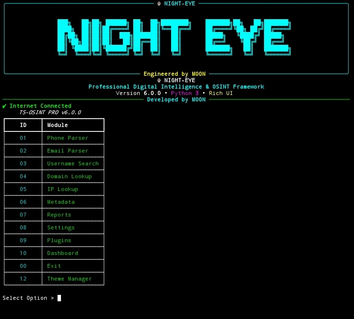

# 👁 NIGHT-EYE

<p align="center">
  <b>Professional Digital Intelligence & Open Source Intelligence (OSINT) Framework</b>
</p>

<p align="center">
Built with ❤️ in Python by <b>M00N</b>
</p>

---

## 📸 Screenshots

### Home Screen



## 🚀 Overview

NIGHT-EYE is a modern Digital Intelligence & Open Source Intelligence (OSINT) framework designed for security researchers, developers, students, and cybersecurity enthusiasts.

The framework focuses on collecting, validating, and presenting publicly available information through a fast, modular, and professional command-line interface powered by Rich.

---

## 📑 Table of Contents

- [Screenshots](#-screenshots)
- [Features](#-features)
- [Installation](#-installation)
- [Usage](#-usage)
- [Requirements](#-requirements)
- [Tested Platforms](#-tested-platforms)
- [Project Structure](#-project-structure)
- [Roadmap](#-roadmap)
- [Contributing](#-contributing)
- [License](#-license)
- [Support](#-support)

## ✨ Features

### 📱 Phone Intelligence

- Phone number validation
- Country detection
- Carrier detection
- Timezone detection
- International & National formatting
- JSON reports
- HTML reports

---

# ⚡ Installation

## 📱 Termux

```bash
pkg update && pkg upgrade -y

pkg install -y git python

git clone https://github.com/err0rb0t999/NIGHT-EYE.git

cd NIGHT-EYE

chmod +x install.sh

bash install.sh

python main.py
```

## 🐧 Kali Linux / Debian / Ubuntu

```bash
sudo apt update

sudo apt install -y git python3 python3-pip

git clone https://github.com/err0rb0t999/NIGHT-EYE.git

cd NIGHT-EYE

chmod +x install.sh

bash install.sh

python3 main.py
```
# ⚡ Quick Start

After installation:

```bash
python main.py
```

Select a module from the interactive menu and start your analysis.

# 🚀 Usage

Start NIGHT-EYE

```bash
python main.py
```

After launching, select a module from the interactive menu.

| Option | Module |
|--------|--------|
| 01 | 📱 Phone Intelligence |
| 02 | 📧 Email Intelligence |
| 03 | 👤 Username Intelligence |
| 04 | 🌐 Domain Intelligence |
| 05 | 🌍 IP Intelligence |
| 06 | 📂 Metadata Analysis |
| 07 | 📊 Reports |
| 08 | ⚙️ Settings |
| 09 | 🧩 Plugins |
| 10 | 📈 Dashboard |
| 11 | 🎨 Theme Manager |
| 00 | ❌ Exit |

# ✨ Features

| Feature | Status | Description |
|----------|:------:|-------------|
| 📱 Phone Intelligence | ✅ | Analyze and validate phone numbers |
| 📧 Email Intelligence | ✅ | Validate email addresses and inspect domains |
| 🌐 Domain Intelligence | ✅ | WHOIS, DNS and SSL information |
| 🌍 IP Intelligence | ✅ | IP geolocation and network information |
| 📊 Dashboard | ✅ | Interactive terminal dashboard |
| 📁 Reports | ✅ | Export reports in JSON and HTML |
| 🎨 Theme Manager | ✅ | Multiple terminal themes |
| ⚙️ Settings | ✅ | Customizable application settings |
| 🧩 Plugin Support | 🚧 | Planned for future releases |


# 📦 Requirements

- Python 3.10 or later
- Git
- Internet connection
- Linux or Termux environment

## Python Packages

- rich
- requests
- phonenumbers
- python-whois
- dnspython

# ✅ Tested Platforms

| Platform | Status |
|----------|:------:|
| 📱 Termux | ✅ |
| 🐉 Kali Linux | ✅ |
| 🐧 Ubuntu | ✅ |
| 🐧 Debian | ✅ |

# 📂 Project Structure

```text
NIGHT-EYE
│
├── assets/
│   └── screenshots/
├── config/
├── data/
├── docs/
├── exports/
├── logs/
├── modules/
├── reports/
├── utils/
│
├── install.sh
├── requirements.txt
├── README.md
├── LICENSE
└── main.py
```

# 🛣️ Roadmap

## Version 1.0
- [x] Phone Intelligence
- [x] Email Intelligence
- [x] Domain Intelligence
- [x] IP Intelligence
- [x] Rich Terminal Interface
- [x] HTML & JSON Reports

## Version 1.1
- [ ] Username Intelligence
- [ ] Metadata Analysis
- [ ] Improved Report Templates
- [ ] Better Error Handling

## Version 2.0
- [ ] Plugin System
- [ ] Multi-language Support
- [ ] Performance Optimizations
- [ ] Additional Intelligence Modules

# 🤝 Contributing

Contributions are welcome.

If you'd like to improve NIGHT-EYE:

1. Fork the repository.
2. Create a new branch.
3. Make your changes.
4. Commit your work.
5. Open a Pull Request.

Please keep contributions focused, well-documented, and tested whenever possible.

### 📧 Email Intelligence

- Email validation
- MX Record lookup
- SPF check
- DKIM detection
- DMARC detection
- Disposable email detection

---

### 🌐 Domain Intelligence

- WHOIS lookup
- DNS Records
- SSL Certificate Summary
- HTTP Headers
- Security Headers

---

### 🌍 IP Intelligence

- IP Geolocation
- ASN Information
- ISP Information
- Reverse DNS
- Organization Details

---

### 📂 Metadata Analysis

- Image Metadata
- PDF Metadata
- Document Metadata

---

### 📊 Reporting

- HTML Reports
- JSON Reports
- CSV Export
- Rich CLI Tables

---

## ⚡ Installation

Clone the repository

```bash
git clone https://github.com/err0rb0t999/NIGHT-EYE.git
```

Enter the directory

```bash
cd NIGHT-EYE
```

Install dependencies

```bash
bash install.sh
```

Run

```bash
python main.py
```

---

## 🖥 Preview

```
👁 NIGHT-EYE

Professional Digital Intelligence & OSINT Framework

✔ Phone Intelligence
✔ Email Intelligence
✔ Domain Intelligence
✔ IP Intelligence

Engineered by M00N
```

---

## 📁 Project Structure

```
NIGHT-EYE
│
├── modules/
├── utils/
├── config/
├── data/
├── exports/
├── logs/
├── banner.py
├── main.py
├── install.sh
└── requirements.txt
```

---

## 🛣 Roadmap

- Advanced Phone Intelligence
- Advanced Email Intelligence
- Plugin System
- Dashboard
- PDF Reports
- REST API
- Auto Update
- Theme Marketplace

---

## 🤝 Contributing

Contributions, suggestions, and bug reports are welcome.

Feel free to open an Issue or submit a Pull Request.

---

## 📄 License

This project is released under the MIT License.

---

## 👨‍💻 Author

**M00N**

Developer of NIGHT-EYE

---

## ⭐ Support

If you found this project useful, please consider giving it a ⭐ on GitHub.

It helps the project grow and motivates future development.

---

> **Disclaimer**
>
> NIGHT-EYE is intended for legitimate security research, learning, and authorized testing only. Users are responsible for ensuring their use complies with applicable laws and respects privacy.

# 💙 Support

If you find NIGHT-EYE useful, consider giving the repository a ⭐.

Feedback, bug reports, and feature suggestions are always appreciated.

# ⚠️ Disclaimer

NIGHT-EYE is intended for educational purposes, security research, and authorized investigations only.

Users are responsible for complying with applicable laws and respecting privacy when using this software.
